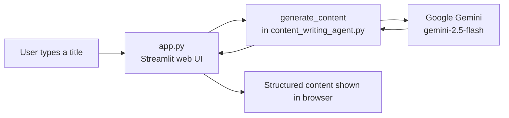

# Understanding the Content Writing Agent

This guide explains how the two main files of **Assignment 1** work, in plain language, for a developer who is new to the project.

- [content_writing_agent.py](content_writing_agent.py) — the "brain": connects to Google Gemini and writes the content.
- [app.py](app.py) — the "face": a Streamlit web page where you type a title and see the result.

## Big picture



The key idea: the agent logic lives in **one** file (`content_writing_agent.py`). Both the terminal version and the website (`app.py`) call the same `generate_content()` function, so behavior is identical no matter how you run it ("single source of truth").

---

## Part 1: `content_writing_agent.py` (the brain)

This file connects to Gemini and turns a topic into well-structured writing (Title, Introduction, Main Content, Conclusion).

### 1. The setup (constants)

```python
GEMINI_BASE_URL = "https://generativelanguage.googleapis.com/v1beta/openai/"
GEMINI_MODEL = "gemini-2.5-flash"
BASE_DIR = Path(__file__).parent
```

- `GEMINI_BASE_URL` — Gemini offers an "OpenAI-compatible" door. By pointing the standard OpenAI client at this URL, we can talk to Gemini using familiar code.
- `GEMINI_MODEL` — the specific model. `gemini-2.5-flash` is fast and works on the free tier.
- `BASE_DIR` — the folder this script lives in, so it can always find `instructions.md` and `.env` no matter where you launch it from.

### 2. `load_instructions()` — reading the rulebook

```python
def load_instructions() -> str:
    instructions_path = BASE_DIR / "instructions.md"
    ...
    return instructions_path.read_text(encoding="utf-8")
```

The agent's "personality" and rules live in [instructions.md](instructions.md). This function reads that file into a string. Keeping the rules in a separate file means you can change how the agent writes **without touching the Python code**.

### 3. `create_agent()` — building the agent

```python
api_key = os.environ.get("GEMINI_API_KEY")
...
chat_client = OpenAIChatCompletionClient(
    model=GEMINI_MODEL,
    api_key=api_key,
    base_url=GEMINI_BASE_URL,
)
return chat_client.as_agent(
    name="ContentWritingAgent",
    instructions=instructions,
)
```

Three steps:
1. Read the secret API key from the environment (loaded from `.env`, so it is never hard-coded in source).
2. Create a chat client pointed at Gemini.
3. `as_agent(...)` glues the model together with the rulebook from `instructions.md`. The result is a ready-to-use agent.

### 4. `generate_content(...)` — the main worker (with retries)

```python
for attempt in range(1, max_retries + 1):
    try:
        result = await agent.run(topic)
        return result.text
    except Exception as error:
        message = str(error)
        is_transient = "503" in message or "UNAVAILABLE" in message
        if not is_transient or attempt == max_retries:
            raise
        wait_seconds = 2 ** attempt  # 2, 4, 8, 16 ...
        ...
        await asyncio.sleep(wait_seconds)
```

This is the heart of the file:
- `await agent.run(topic)` sends the topic to Gemini and gets the written content back.
- **Why the loop?** Sometimes Gemini is briefly overloaded and returns a temporary "503 / unavailable" error. Instead of crashing, the code waits and tries again, doubling the wait each time (2s, 4s, 8s...). This is called **exponential backoff**.
- It only retries on *transient* errors. A real problem (like a bad API key) is raised immediately so you see it.

> `async`/`await` is used because talking to a network service involves waiting. It lets the program pause efficiently instead of freezing.

### 5. `main()` — the terminal version

```python
load_dotenv(BASE_DIR / ".env")
if len(sys.argv) > 1:
    topic = " ".join(sys.argv[1:])
else:
    topic = input("Enter the content topic: ").strip()
...
content = await generate_content(topic)
print(content)
```

When you run the script directly, it accepts the topic two ways:
- As a command-line argument: `python content_writing_agent.py "Benefits of reading books"`
- Or interactively: it asks "Enter the content topic:" if you give no argument.

The final line starts everything:

```python
if __name__ == "__main__":
    asyncio.run(main())
```

`asyncio.run(...)` starts the event loop needed for the `async` code.

---

## Part 2: `app.py` (the face — Streamlit UI)

Streamlit turns a plain Python script into a web page. You write top-to-bottom Python, and Streamlit renders each widget in the browser. Every time the user interacts, Streamlit **re-runs the whole script** from top to bottom.

### 1. Imports and key loading

```python
import streamlit as st
from content_writing_agent import generate_content
...
load_dotenv(BASE_DIR / ".env")
```

- It imports `generate_content` from the brain file — **reusing the same logic**, not duplicating it.
- It loads the `GEMINI_API_KEY` from `.env` so the key is available in the browser session.

### 2. Page setup

```python
st.set_page_config(page_title="Content Writing Agent", page_icon="✍️", layout="centered")
st.title("✍️ Content Writing Agent")
st.caption("Powered by Google Gemini and the Microsoft Agent Framework. ...")
```

This sets the browser tab title/icon and draws the heading and subtitle on the page.

### 3. The input form

```python
with st.form("content_form"):
    title = st.text_input("Blog / Content Title", placeholder="e.g. The Importance of Water")
    submitted = st.form_submit_button("Generate Content")
```

- `st.form(...)` groups inputs so the agent **only runs when the button is clicked**, not on every keystroke (important, because each agent call costs an API request).
- `title` holds whatever the user typed.
- `submitted` becomes `True` only on the click.

### 4. Handling the click

```python
if submitted:
    if not title.strip():
        st.warning("Please enter a title to generate content.")
    else:
        with st.spinner("Generating content, please wait..."):
            try:
                content = asyncio.run(generate_content(title.strip()))
                st.markdown(content)
            except Exception as error:
                st.error(f"Something went wrong: {error}")
```

Step by step:
1. **Validate** — if the box is empty, show a warning and stop.
2. **Spinner** — `st.spinner(...)` shows a "loading" animation while the agent works.
3. **Call the agent** — `asyncio.run(generate_content(...))` runs the async brain function and waits for the result.
4. **Display** — `st.markdown(content)` renders the result, so headings and bullet points look nice.
5. **Error handling** — any problem (missing key, quota limit) is shown with `st.error(...)` instead of crashing the page.

---

## How to run it

**Web UI (recommended):**

```powershell
cd "Assignment 1-Content Writing Agent"
.\.venv\Scripts\python.exe -m streamlit run app.py
```

Then open `http://localhost:8501`.

**Terminal version:**

```powershell
cd "Assignment 1-Content Writing Agent"
.\.venv\Scripts\python.exe content_writing_agent.py "The importance of water"
```

> Tip: if the browser shows a different app, an old Streamlit session may still be running on port `8501`. Press `Ctrl+C` in its terminal first, then relaunch from the correct folder.

---

## How the pieces fit together

| File | Job | Key function |
|------|-----|--------------|
| `content_writing_agent.py` | Talk to Gemini and generate content | `generate_content(topic)` |
| `app.py` | Show a web form and display the result | (imports `generate_content`) |
| `instructions.md` | The agent's writing rules | (read by `load_instructions()`) |

## 5 things to remember

1. **Single source of truth** — the terminal script and the website call the *same* `generate_content()` function.
2. **Secrets stay in `.env`** — the API key is read from the environment, never hard-coded.
3. **Rules live in `instructions.md`** — change the agent's style without editing Python.
4. **Resilience by design** — the agent retries on transient "503 busy" errors with exponential backoff.
5. **Streamlit re-runs top-to-bottom** — the form + `if submitted:` pattern makes sure the agent only runs on a real click.
