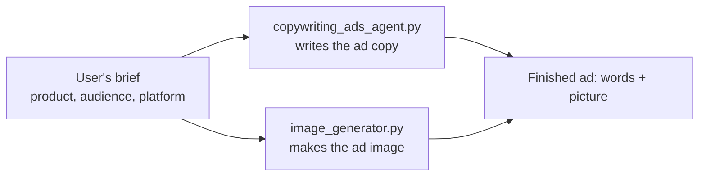
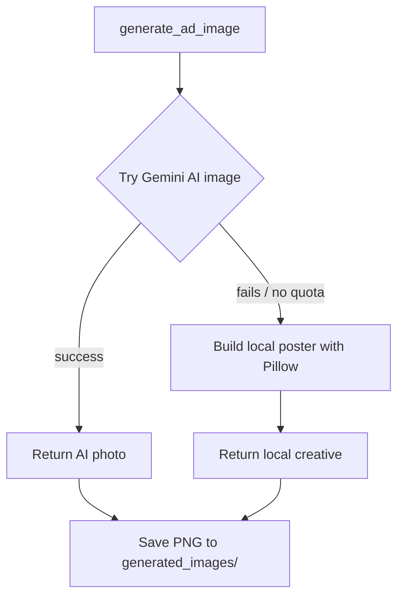

# Understanding `copywriting_ads_agent.py` and `image_generator.py`

This guide explains the two "backend brain" files of the Copywriting & Ads Agent in plain language, for a developer who is new to the project. The Streamlit UI ([app.py](../Assignment%202-Copywriting%20&%20Ads%20Agent/app.py)) is just the face; these two files do the real work.

- [copywriting_ads_agent.py](../Assignment%202-Copywriting%20&%20Ads%20Agent/copywriting_ads_agent.py) — writes the **words** (Headline, Body, Call-to-Action).
- [image_generator.py](../Assignment%202-Copywriting%20&%20Ads%20Agent/image_generator.py) — makes the **picture** (the ad graphic).

## Big picture

Think of an ad as having two halves:



Both files can run on their own from the terminal, and both are also imported by `app.py` so the website reuses the exact same logic (a single source of truth).

---

## Part 1: `copywriting_ads_agent.py` (the writer)

This file connects to Google Gemini and turns a short brief into polished ad copy.

### 1. The setup (constants)

```python
GEMINI_BASE_URL = "https://generativelanguage.googleapis.com/v1beta/openai/"
GEMINI_MODEL = "gemini-2.5-flash"
BASE_DIR = Path(__file__).parent
```

- `GEMINI_BASE_URL` — Gemini offers an "OpenAI-compatible" door. By pointing the standard OpenAI client at this URL, we can talk to Gemini using familiar code. This is the **same config as Assignment 1**.
- `GEMINI_MODEL` — the specific text model. `gemini-2.5-flash` is fast and has free-tier quota for text.
- `BASE_DIR` — the folder this script lives in. Used so the script can always find `instructions.md` and `.env` no matter where you launch it from.

### 2. `load_instructions()` — reading the rulebook

```python
def load_instructions() -> str:
    instructions_path = BASE_DIR / "instructions.md"
    ...
    return instructions_path.read_text(encoding="utf-8")
```

The agent's "personality" and rules (catchy headlines, platform-specific tone, output structure) live in [instructions.md](../Assignment%202-Copywriting%20&%20Ads%20Agent/instructions.md). This function just reads that file into a string. Keeping rules in a separate file means you can change the agent's behavior without touching the Python code.

### 3. `create_agent()` — building the brain

```python
api_key = os.environ.get("GEMINI_API_KEY")
...
chat_client = OpenAIChatCompletionClient(
    model=GEMINI_MODEL,
    api_key=api_key,
    base_url=GEMINI_BASE_URL,
)
return chat_client.as_agent(
    name="CopywritingAdsAgent",
    instructions=instructions,
)
```

Three steps:
1. Read the secret API key from the environment (loaded from `.env`, so it is never hard-coded).
2. Create a chat client pointed at Gemini.
3. `as_agent(...)` glues the model together with the rulebook from `instructions.md`. The result is a ready-to-use agent.

### 4. `build_brief(...)` — formatting the request

```python
lines = [
    "Please write ad copy based on the following brief:",
    f"- Product/Service: {product}",
    f"- Target Audience: {audience}",
    f"- Advertising Platform: {platform}",
]
```

This takes the separate inputs (product, audience, platform, optional key points and tone) and stitches them into one tidy text message. Optional fields are only added if the user filled them in. This single string is what gets sent to the agent.

### 5. `generate_ad_copy(...)` — the main worker (with retries)

```python
for attempt in range(1, max_retries + 1):
    try:
        result = await agent.run(brief)
        return result.text
    except Exception as error:
        message = str(error)
        is_transient = "503" in message or "UNAVAILABLE" in message
        if not is_transient or attempt == max_retries:
            raise
        wait_seconds = 2 ** attempt  # 2, 4, 8, 16 ...
        ...
        await asyncio.sleep(wait_seconds)
```

This is the heart of the file:
- `await agent.run(brief)` sends the brief to Gemini and gets the ad copy back.
- **Why the loop?** Sometimes Gemini is briefly overloaded and returns a temporary "503 / unavailable" error. Instead of crashing, the code waits and tries again, doubling the wait each time (2s, 4s, 8s...). This is called **exponential backoff**.
- It only retries on *transient* errors. A real problem (like a bad API key) is raised immediately so you see it.

> `async`/`await` is used because talking to a network service involves waiting. It lets the program pause efficiently instead of freezing.

### 6. `main()` — the terminal version

```python
load_dotenv(BASE_DIR / ".env")
product = input("Product / Service: ").strip()
...
copy = await generate_ad_copy(product, audience, platform, key_points, brand_tone)
print(copy)
```

When you run `python copywriting_ads_agent.py` directly, this asks you questions in the terminal, then prints the ad copy. The website (`app.py`) skips this and calls `generate_ad_copy(...)` itself.

The final line starts everything:

```python
if __name__ == "__main__":
    asyncio.run(main())
```

`asyncio.run(...)` starts the event loop needed for the `async` code.

---

## Part 2: `image_generator.py` (the artist)

This file produces the ad graphic. Its key idea is a **two-tier strategy**: try the fancy AI image first, and if that is not available, fall back to a reliable local poster so the demo never fails.



### 1. The setup

```python
GEMINI_IMAGE_MODEL = "gemini-2.5-flash-image"
BASE_DIR = Path(__file__).parent
OUTPUT_DIR = BASE_DIR / "generated_images"
```

- `GEMINI_IMAGE_MODEL` — Gemini's image model (the preferred engine).
- `OUTPUT_DIR` — where finished images are saved on disk.

### 2. `build_image_prompt(...)` — describing the picture

```python
prompt = (
    f"Create a high-quality, professional advertising graphic for: {product}. "
    f"The ad targets {audience} and will run on {platform}. "
)
...
prompt += "...Avoid heavy or garbled on-image text; focus on imagery and mood."
```

This turns the brief into a description for the image model. Notice it deliberately asks the AI to **avoid baking in text** — AI-generated words often look garbled, so the real words come from the copy agent instead.

### 3. `_generate_via_gemini(prompt)` — the primary (AI) engine

```python
client = genai.Client(api_key=api_key)
response = client.models.generate_content(
    model=GEMINI_IMAGE_MODEL,
    contents=[prompt],
    config=types.GenerateContentConfig(
        response_modalities=["TEXT", "IMAGE"],
    ),
)
for part in response.candidates[0].content.parts:
    if getattr(part, "inline_data", None) and part.inline_data.data:
        return part.inline_data.data
```

- Uses Google's native `google-genai` SDK with the **same** `GEMINI_API_KEY`.
- Asks for both TEXT and IMAGE back, then digs through the response to pull out the raw image bytes.
- **Important:** Gemini image models are *not* on the free tier. With a free key this raises a `429 RESOURCE_EXHAUSTED` (limit: 0) error — which is exactly why the fallback below exists. (The leading `_` in the name signals it is an internal helper.)

### 4. The Pillow helpers (the fallback artist)

When the AI image is unavailable, the code draws a clean poster itself using Pillow (PIL).

- `_load_font(size, bold)` — loads a real font (Arial/DejaVu), or falls back to Pillow's built-in font so it never crashes.
- `_brand_colors(seed)` — turns the product name into a repeatable two-color gradient using an MD5 hash. The same product always gets the same colors.

### 5. `_generate_via_pillow(...)` — drawing the poster

This composes a 1024×1024 image step by step:

1. **Gradient background** — loops over every row and blends the top color into the bottom color.
2. **Platform badge** — a white rounded pill in the top-left showing "FACEBOOK", "GOOGLE", etc.
3. **Headline** — the product name, wrapped and centered in big bold text.
4. **Sub-headline** — the first key benefit (if provided).
5. **Call-to-action pill** — a "Learn More" button near the bottom.
6. Finally it saves to PNG bytes in memory:

```python
buffer = io.BytesIO()
image.save(buffer, format="PNG")
return buffer.getvalue()
```

This needs **no API key and no internet**, so it always succeeds.

### 6. `generate_ad_image(...)` — the public function that ties it together

```python
try:
    image_bytes = _generate_via_gemini(prompt)
    engine = "Gemini (AI image)"
except Exception as gemini_error:
    print(f"Gemini image generation unavailable, using local fallback: {gemini_error}")
    image_bytes = _generate_via_pillow(product, audience, platform, key_points)
    engine = "Local Pillow ad creative"

OUTPUT_DIR.mkdir(exist_ok=True)
...
output_path.write_bytes(image_bytes)
return image_bytes, engine
```

This is the only function the rest of the app calls. It:
1. Builds the prompt.
2. **Tries Gemini first.** If that throws any error, it **falls back** to Pillow.
3. Saves a copy of the image into `generated_images/`.
4. Returns a tuple: `(image_bytes, engine_label)`. The label ("Gemini (AI image)" or "Local Pillow ad creative") is what the UI shows in its caption so you know which engine produced the picture.

### 7. The manual test block

```python
if __name__ == "__main__":
    from dotenv import load_dotenv
    load_dotenv(BASE_DIR / ".env")
    data, used_engine = generate_ad_image(
        product="EcoSip reusable water bottle",
        ...
    )
    print(f"Generated image: {len(data)} bytes via {used_engine}, ...")
```

Running `python image_generator.py` directly makes one sample image, so you can test the file by itself without the website.

---

## How the pieces fit together

| File | Job | Key function the UI calls |
|------|-----|---------------------------|
| `copywriting_ads_agent.py` | Write the ad words | `generate_ad_copy(...)` |
| `image_generator.py` | Make the ad picture | `generate_ad_image(...)` |
| `app.py` | Show a web form and display results | (imports both above) |

## 6 things to remember

1. **Separation of concerns** — words and pictures live in separate files; `app.py` just orchestrates them.
2. **Single source of truth** — the terminal scripts and the website call the *same* functions, so behavior is identical.
3. **Secrets stay in `.env`** — the API key is read from the environment, never hard-coded.
4. **Same Gemini config as Assignment 1** — same base URL, same key, `gemini-2.5-flash` for text.
5. **Resilience by design** — copy generation retries on transient errors; image generation falls back to Pillow so the demo always produces something.
6. **Free tier = text only** — Gemini image models need billing enabled; without it you will always see the "Local Pillow ad creative" engine, and that is expected.
