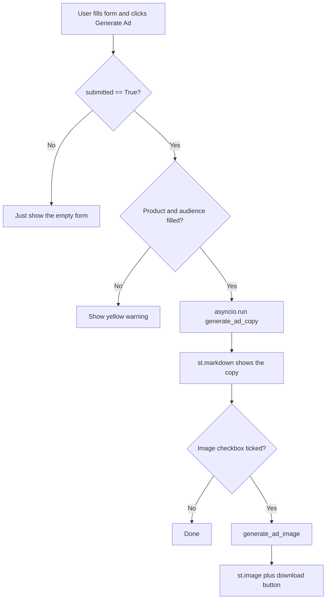

# Internal Workflow — `app.py` (Copywriting & Ads Agent UI)

This document explains how [app.py](../Assignment%202-Copywriting%20&%20Ads%20Agent/app.py) works, written for a developer seeing Streamlit for the first time.

## The big picture first

This file is the **web page**. It does not contain any AI logic itself — it just:

1. Draws a form in the browser,
2. Collects what the user types,
3. Calls two helper functions (one for text, one for the image) that live in *other* files,
4. Shows the results back on the page.

Think of `app.py` as the **waiter**: it takes your order and brings the food, but the **kitchen** is `copywriting_ads_agent.py` and `image_generator.py`.

One key Streamlit idea up front: **the whole script re-runs top to bottom every time the user interacts** (clicks a button, types, etc.). There is no "onClick" function like in other frameworks — Streamlit just runs the file again and figures out what changed. This explains the structure.

## Section 1 — The docstring (lines 1–16)

```python
"""
app.py
------
A simple Streamlit web UI for the Copywriting & Ads Agent.
...
Run it from the terminal:
    streamlit run app.py
"""
```

The triple-quoted block at the very top is a **docstring** — documentation for a human reading the file. It has no effect on the program. The most useful line is the run command: you start this app with `streamlit run app.py`, **not** `python app.py`.

## Section 2 — Imports (lines 18–25)

```python
import asyncio
from pathlib import Path

import streamlit as st
from dotenv import load_dotenv

from copywriting_ads_agent import generate_ad_copy
from image_generator import generate_ad_image
```

Imports = "tools I am borrowing from elsewhere."

- `asyncio` — Python's library for running **asynchronous** code. The AI text function is `async`, and `asyncio` is what lets us run it.
- `Path` — a clean way to work with file/folder paths.
- `streamlit as st` — the web UI library. `as st` means "refer to it by the short name `st`," so we write `st.title(...)` instead of `streamlit.title(...)`.
- `load_dotenv` — reads the secret API key from the `.env` file.
- `generate_ad_copy` and `generate_ad_image` — **your own functions** from the other two files. This is the "single source of truth" idea: the actual work is defined once, and the UI just calls it.

## Section 3 — Finding and loading the API key (lines 27–34)

```python
BASE_DIR = Path(__file__).parent
load_dotenv(BASE_DIR / ".env")
```

- `__file__` is a built-in variable meaning "the path to *this* file" (`app.py`). `.parent` gives the **folder** it lives in. So `BASE_DIR` = the Assignment 2 folder.
- `BASE_DIR / ".env"` builds the path to the `.env` file sitting next to `app.py`. The `/` here is a Path feature that joins paths — it works on Windows and Mac.
- `load_dotenv(...)` opens that `.env` file and loads `GEMINI_API_KEY` into the environment so the AI functions can find it.

Why bother with `BASE_DIR`? Because Streamlit might be launched from a different folder. Pinning the path to the script's own location means the key is always found.

## Section 4 — Page setup (lines 36–52)

```python
st.set_page_config(
    page_title="Copywriting & Ads Agent",
    page_icon="📣",
    layout="centered",
)

st.title("📣 Copywriting & Ads Agent")
st.caption("Powered by Google Gemini ...")
```

This is where the page starts drawing.

- `st.set_page_config(...)` — sets the **browser tab** title, the tab icon, and centers the content. This must be the first Streamlit call.
- `st.title(...)` — the big heading at the top of the page.
- `st.caption(...)` — small grey subtitle text under the title.

Every `st.something(...)` call **adds an element to the page**, from top to bottom, in the order they run.

## Section 5 — The input form (lines 54–84)

```python
with st.form("ad_form"):
    product = st.text_input("Product / Service", placeholder="...")
    audience = st.text_input("Target Audience", placeholder="...")
    platform = st.selectbox("Advertising Platform", ["Facebook", "Google", "LinkedIn"])
    key_points = st.text_area("Key Points / Benefits (optional)", placeholder="...")
    brand_tone = st.text_input("Brand Tone / Voice (optional)", placeholder="...")
    make_image = st.checkbox("Also generate an ad graphic/image", value=True)
    submitted = st.form_submit_button("Generate Ad")
```

This builds the input boxes. The `with st.form("ad_form"):` wrapper is important.

**Why a form?** Streamlit re-runs the whole script on *every* interaction. Without a form, the AI would try to run every time you typed a single letter. A form **batches** all the inputs and only submits them when the button is clicked — so the expensive AI call happens once, on purpose.

Each widget **returns the user's current value**, which we store in a variable:

- `st.text_input(...)` → a single-line box → returns the typed string.
- `st.selectbox(..., [list])` → a dropdown → returns the chosen item.
- `st.text_area(...)` → a bigger multi-line box.
- `st.checkbox(..., value=True)` → a tick box, `True`/`False`. `value=True` means it starts ticked.
- `st.form_submit_button("Generate Ad")` → the submit button → returns `True` **only on the run where it was just clicked**, otherwise `False`. We capture that in `submitted`.

The `placeholder="..."` text is the faint grey example shown inside an empty box.

## Section 6 — Handling the click (lines 86–94)

```python
if submitted:
    if not product.strip() or not audience.strip():
        st.warning("Please provide at least a product and a target audience.")
    else:
        ...
```

- `if submitted:` — everything below only runs on the run where the button was clicked. On all other re-runs, `submitted` is `False` and this block is skipped (so the page just shows the empty form).
- `.strip()` removes spaces from the ends of the text. `not product.strip()` is `True` when the box is empty (or only spaces).
- So: if the required fields are missing, show a yellow `st.warning(...)` and stop. Otherwise (`else`), proceed to generate.

This is basic **input validation** — never trust that the user filled things in.

## Section 7 — Generating the ad copy (lines 95–110)

```python
with st.spinner("Writing ad copy, please wait..."):
    try:
        copy = asyncio.run(
            generate_ad_copy(
                product.strip(),
                audience.strip(),
                platform,
                key_points.strip(),
                brand_tone.strip(),
            )
        )
        st.subheader("Ad Copy")
        st.markdown(copy)
    except Exception as error:
        st.error(f"Could not generate ad copy: {error}")
```

Three concepts here:

1. **`with st.spinner(...)`** — shows a small "loading…" animation while the indented code runs, then removes it automatically. Good UX for slow operations.
2. **`asyncio.run(generate_ad_copy(...))`** — `generate_ad_copy` is an **async** function (it waits on the network for Gemini to reply). Async functions cannot just be called normally; `asyncio.run(...)` runs it and waits for the final answer. The string result lands in `copy`.
3. **`try` / `except`** — error handling. If anything goes wrong inside `try` (bad API key, no internet, quota error), Python jumps to `except`, and instead of the app crashing, the user sees a red `st.error(...)` message. `as error` captures the actual error so we can show its details.

On success:

- `st.subheader("Ad Copy")` adds a medium heading.
- `st.markdown(copy)` renders the text. **`st.markdown`** (vs `st.write` or `st.text`) means the agent's formatting — bold `**Headline:**`, bullet points — displays nicely instead of as raw symbols.

## Section 8 — Generating the image (lines 112–135)

```python
if make_image:
    with st.spinner("Generating ad graphic, please wait..."):
        try:
            image_bytes, engine = generate_ad_image(
                product.strip(), audience.strip(), platform, key_points.strip(),
            )
            st.subheader("Ad Graphic")
            st.caption(f"Image engine: {engine}")
            st.image(image_bytes, caption=f"Ad image for {product}")
            st.download_button(
                "Download image",
                data=image_bytes,
                file_name="ad_image.png",
                mime="image/png",
            )
        except Exception as error:
            st.error(f"Could not generate the ad graphic: {error}")
```

- `if make_image:` — only runs if the checkbox was ticked. The user can opt out of the (slower) image step.
- `image_bytes, engine = generate_ad_image(...)` — this function returns **two things at once** (a tuple): the raw image data, and a label saying which engine made it ("Gemini" or the local fallback). This line **unpacks** them into two variables in one go.
- This call is **not** wrapped in `asyncio.run` — because `generate_ad_image` is a normal (synchronous) function, not async. You only use `asyncio.run` for `async` functions.
- `st.image(image_bytes, caption=...)` — displays the picture. Streamlit can take raw bytes directly.
- `st.download_button(...)` — gives the user a button to save the PNG. `data=` is the file content, `file_name=` is the suggested name, `mime="image/png"` tells the browser it is a PNG image.

## How the data flows (mental model)



## The 6 things to remember as a new developer

1. **The script re-runs top-to-bottom on every interaction** — that is the Streamlit mental model.
2. **`st.form` batches inputs** so the AI only runs on button click, not every keystroke.
3. **Each `st.*` widget returns its value**, which you store in a variable.
4. **`st.form_submit_button` returns `True` only on the click run** — that is how you trigger work.
5. **`asyncio.run(...)`** is needed for the `async` text function; the image function is normal so it does not need it.
6. **`try/except` plus `st.error`** keep the app from crashing and show friendly messages.
