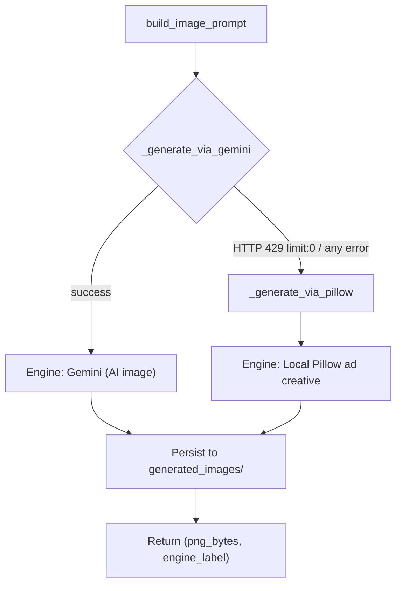

# Project Pitch: AI-Powered Content Generation Suite

**Audience:** Technical reviewers, engineering peers, and architecture stakeholders
**Scope:** Two production-style reference implementations demonstrating agentic LLM orchestration on a shared, vendor-neutral foundation.

---

## Executive Summary

This suite comprises two self-contained agentic applications built on the **Microsoft Agent Framework** and backed by **Google Gemini** through its OpenAI-compatible inference surface. Both projects share an identical LLM client configuration, secret-management strategy, and resilience model, demonstrating a reusable architectural baseline that scales from a single-output text agent (Assignment 1) to a multi-modal, multi-stage generation pipeline with graceful degradation (Assignment 2).

The design intent is to showcase **separation of concerns**, **instruction-driven agent behavior**, and **fault-tolerant inference** — patterns that translate directly to production GenAI workloads.

---

## Architectural Foundation (Shared Across Both Assignments)

| Concern | Implementation | Rationale |
|---------|----------------|-----------|
| LLM client | `agent_framework.openai.OpenAIChatCompletionClient` | Vendor-agnostic abstraction over the chat-completions contract |
| Inference backend | Gemini `gemini-2.5-flash` via OpenAI-compatible base URL (`/v1beta/openai/`) | Free-tier text quota, low latency, no SDK lock-in |
| Agent composition | `chat_client.as_agent(name=..., instructions=...)` | Binds the model to externalized behavior rules at construction time |
| Behavior definition | Externalized `instructions.md` (system-prompt layer) | Decouples prompt engineering from application code; enables non-code iteration |
| Secret management | `python-dotenv` → `GEMINI_API_KEY` from `.env` | No hard-coded credentials; 12-factor config |
| Concurrency model | `asyncio` event loop; `await agent.run(...)` | Non-blocking I/O for network-bound inference calls |
| Resilience | Exponential backoff retry on transient `503`/`UNAVAILABLE` | Absorbs upstream throttling spikes without surfacing failures |

**Key architectural assertion:** Both applications expose their core logic as a single async entry-point function (`generate_content()` / `generate_ad_copy()`). The CLI (`__main__`) and the Streamlit presentation layer (`app.py`) are *both* thin consumers of this function — a **single source of truth** that eliminates logic drift between interfaces.

---

## Assignment 1 — Content Writing Agent

### Problem statement
Deterministic, structured long-form content generation (Title → Introduction → Main Content → Conclusion) from a single topic input.

### Technical breakdown

- **`content_writing_agent.py`** (domain layer)
  - `load_instructions()` — hydrates the system-prompt contract from `instructions.md` at runtime, resolved relative to `BASE_DIR` (path-independent execution).
  - `create_agent()` — instantiates the chat-completions client and binds it to instructions via `as_agent()`, returning a configured agent handle named `ContentWritingAgent`.
  - `generate_content(topic, max_retries=5)` — the async core. Wraps `agent.run()` in a bounded retry loop with **exponential backoff** (`2 ** attempt` → 2s, 4s, 8s, 16s). Critically, it **discriminates transient from terminal failures** — only `503`/`UNAVAILABLE` errors trigger retry; auth or quota errors propagate immediately for fast feedback.
  - `main()` — dual-mode ingestion: accepts the topic via `sys.argv` (scriptable/CI-friendly) or interactive `input()` fallback.

- **`app.py`** (presentation layer)
  - Streamlit re-runs top-to-bottom on every interaction; the `st.form` + `st.form_submit_button` pattern **gates inference to explicit submission**, preventing per-keystroke API spend.
  - `asyncio.run(generate_content(...))` bridges Streamlit's synchronous execution model to the async domain layer.
  - Output rendered via `st.markdown` (preserves structural formatting); failures isolated with `st.error`.

### Value demonstrated
Clean layering, instruction-as-config, and a retry strategy that is selective rather than naive.

---

## Assignment 2 — Copywriting & Ads Agent

### Problem statement
Multi-modal advertising asset generation: platform-specific persuasive copy (Headline / Body / CTA) **plus** a matching visual creative, from a structured advertising brief.

### Technical breakdown

Assignment 2 extends the Assignment 1 baseline into a **two-stage, multi-modal pipeline** with a **fallback-driven reliability guarantee**.

#### Stage 1 — Copy generation (`copywriting_ads_agent.py`)
- Reuses the *exact* LLM configuration from Assignment 1 (same client, model, key, retry logic) — demonstrating architectural reuse.
- `build_brief(...)` — a **structured-input serializer** that marshals discrete fields (product, audience, platform, optional key points, optional brand tone) into a single normalized prompt aligned with the `instructions.md` contract. This enforces input consistency and keeps the prompt schema centralized.
- `generate_ad_copy(...)` — async core mirroring Assignment 1's retry/backoff semantics, returning structured copy.

#### Stage 2 — Image generation (`image_generator.py`)
This is the architecturally distinctive component: a **primary/fallback strategy** that guarantees a non-failing output path.

- **Primary path** — `_generate_via_gemini()` calls the native `google-genai` SDK against `gemini-2.5-flash-image`, requesting dual `["TEXT", "IMAGE"]` response modalities and extracting the first inline image payload. *Constraint:* Gemini image models carry **zero free-tier quota** (HTTP 429, `limit: 0`) without billing enabled — a documented, expected condition.
- **Fallback path** — `_generate_via_pillow()` composes a deterministic ad poster entirely offline. Notable techniques:
  - `_brand_colors()` derives a **deterministic two-color gradient** from an MD5 hash of the product name — same product always yields the same palette (reproducibility without state).
  - Procedural composition: vertical gradient fill, rounded-rectangle platform badge, wrapped/anchored headline, sub-headline from the first key benefit, and a CTA pill — all via Pillow's `ImageDraw` primitives with graceful TrueType-font fallback (`_load_font`).
- **Contract** — `generate_ad_image()` returns `(png_bytes, engine_label)` and side-effects a persisted asset to `generated_images/`. The `engine_label` provides **observability** into which path served the request.

#### Presentation layer (`app.py`)
Orchestrates both stages sequentially with independent `st.spinner` contexts and isolated error boundaries, surfaces the engine label via `st.caption`, and exposes the asset through `st.image` + `st.download_button`.

### Value demonstrated
Multi-modal orchestration, a **degradation strategy that converts an external dependency failure into a guaranteed local success**, and deterministic procedural generation — the demo *never* fails to produce a complete ad.

---

## Comparative Positioning

| Dimension | Assignment 1 | Assignment 2 |
|-----------|--------------|--------------|
| Modality | Text only | Text + image (multi-modal) |
| Pipeline stages | Single | Two-stage (copy → creative) |
| Input model | Single free-text topic | Structured brief (5 fields) |
| Failure posture | Retry transient, fail terminal | Retry transient **+ guaranteed image fallback** |
| External dependencies | Gemini text | Gemini text, Gemini image, Pillow |
| Reuse | Establishes the baseline | Consumes the baseline verbatim |

---

## Engineering Takeaways

1. **Vendor-neutral by design** — the OpenAI-compatible abstraction means the backend can be swapped (Gemini → OpenAI → Azure OpenAI) with a base-URL/model change, no application rewrite.
2. **Instruction-driven agents** — behavior lives in `instructions.md`, enabling prompt iteration without code deploys.
3. **Single source of truth** — CLI and web UIs are thin shells over one async core; zero logic duplication.
4. **Selective resilience** — backoff is applied only to transient classes, preserving fast-fail semantics for real defects.
5. **Guaranteed-output pipeline** — the Pillow fallback transforms a hard external dependency (paid image quota) into a soft, locally satisfiable one, making the system demo-safe and offline-capable.
6. **Observability baked in** — the returned `engine_label` makes the active generation path explicit at the UI layer.

---

## Suggested Talking Points for a Technical Audience

- How the **`as_agent()` binding** cleanly separates model configuration from behavior contract.
- The **discriminated retry** logic and why naive "retry-all" is an anti-pattern here.
- The **primary/fallback image strategy** as a microcosm of resilient distributed-system design (graceful degradation, deterministic fallback, observability via engine label).
- The **structured-brief serializer** as a guard against prompt drift in multi-field inputs.
